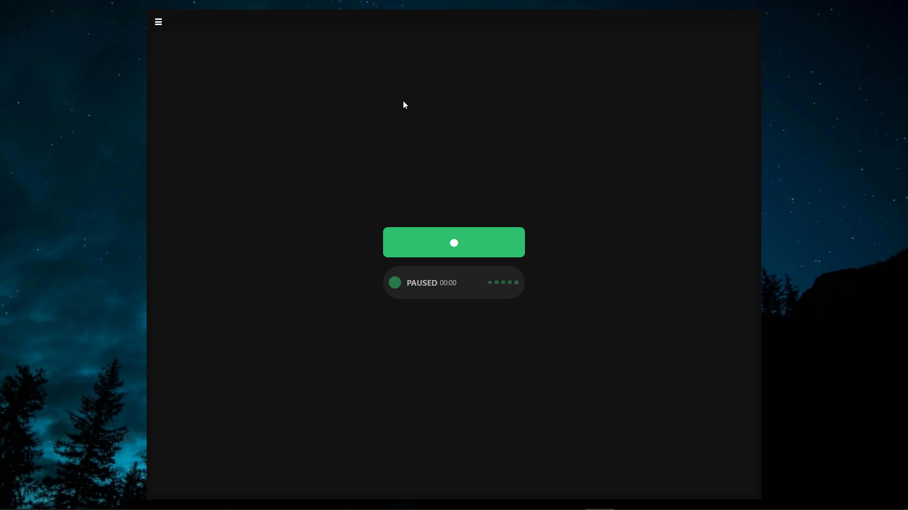
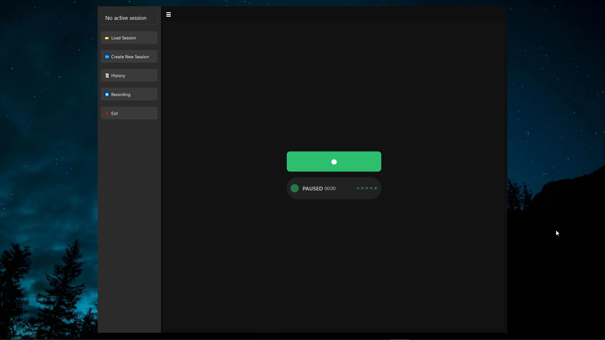
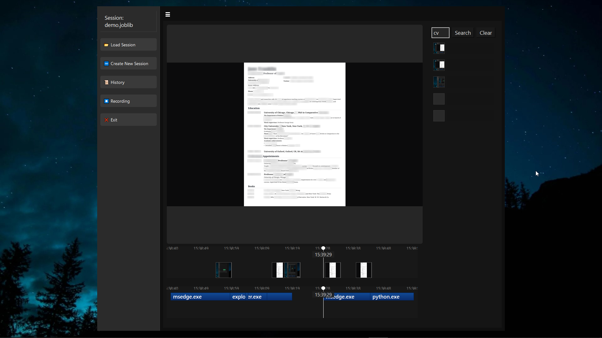
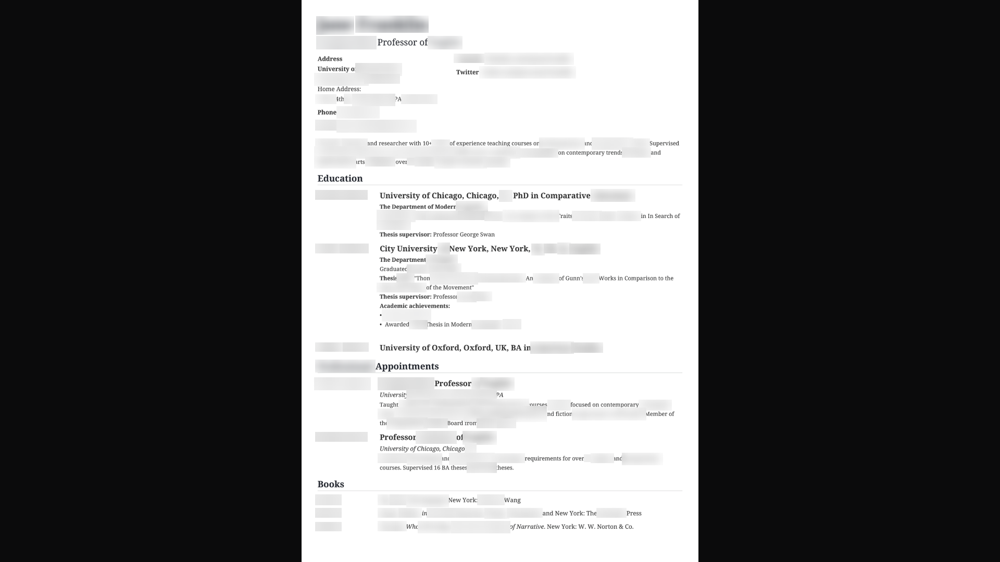

# Screen Activity Recorder (Beta)

Screen Activity Recorder is a desktop application that captures screen activity, tracks active applications, extracts text using OCR, detects sensitive information using NER, and stores everything in a searchable FAISS index.
The goal is to provide a lightweight knowledge timeline of your computer usage that you can search later by keywords, applications, or screenshot content.

This project is currently in **beta**. Features and stability may change frequently.


## Features

* Periodic screenshot capture
* OCR (Doctr / EasyOCR) text extraction
* Sensitive information detection and automatic blurring
* Application activity tracking
* Keyword extraction with KeyBERT
* Embedding generation using Sentence Transformers
* FAISS vector index for fast semantic search
* PyQt-based user interface


## Demo Screenshots

Below are sample images from the application (stored in the `demo/` directory):

### 1



### 2



### 3



### before 4


### after




## Installation

### 1. Clone the Repository

```bash
git clone https://github.com/your-username/activity-screen-recorder.git
cd activity-screen-recorder
```


## Virtual Environment Setup

### 2. Create a virtual environment

```bash
python -m venv venv
```

### 3. Activate the virtual environment

**Windows**

```bash
venv\Scripts\activate
```

**Mac / Linux**

```bash
source venv/bin/activate
```


## Install Dependencies

### 4. Upgrade pip

```bash
pip install --upgrade pip
```

### 5. Install all required packages

```bash
pip install -r requirements.txt
```

Note:

* Some packages like **PyQt5**, **faiss**, **torch**, **easyocr**, and **doctr** may take time to install.
* FAISS installation on Windows may require `faiss-cpu` from PyPI.


## Running the Application

```bash
python app.py
```

Once launched, the PyQt interface will allow you to:

* Start/stop screen recording
* Track active applications
* Search past activities
* Browse screenshot history


## Project Structure (Overview)

.
├── app.py
├── services/
├── core/
├── schemas/
├── utils/
├── ui/
├── models/
├── data/
└── demo/

## Status

This software is still in **beta**.
Expect incomplete features, potential crashes, and rapid changes in design.
Please report issues and suggestions to help improve stability.

